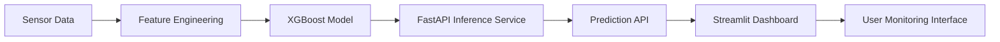

# Predictive Maintenance System

A production-grade end-to-end ML system for industrial equipment failure prediction.
Predicts the probability of machine failure within 7 days from real-time sensor readings.


## Architecture
System Architecture
...
---

## Architecture

## System Architecture


```
Data Generation → Feature Engineering → XGBoost Training → FastAPI Service → Streamlit Dashboard
                                              ↓
                                      model/artifacts/
                                      ├── model.pkl
                                      ├── scaler.pkl
                                      └── threshold.json
```

## Project Structure

```
predictive_maintenance/
├── app/                    # FastAPI inference service
│   ├── main.py             # Routes and lifespan
│   ├── schemas.py          # Pydantic I/O models
│   ├── predictor.py        # Model loading + inference
│   └── logger.py           # JSON structured logging
├── model/                  # ML pipeline
│   ├── train.py            # Full training pipeline
│   ├── features.py         # Feature engineering (shared)
│   └── evaluate.py         # Metrics + threshold selection
├── data/
│   └── generate_dataset.py # Synthetic dataset generator
├── dashboard/
│   └── app.py              # Streamlit UI
├── tests/
│   ├── test_api.py         # API integration tests
│   └── test_pipeline.py    # Pipeline unit tests
├── Dockerfile
├── docker-compose.yml
└── requirements.txt
```

---

## Quickstart (Windows Native)

### 1. Prerequisites

Install Python 3.11 from https://python.org/downloads

### 2. Create virtual environment

```cmd
python -m venv .venv
.venv\Scripts\activate
```

### 3. Install dependencies

```cmd
pip install -r requirements.txt
```

### 4. Download the AI4I 2020 Dataset

**Option A — Auto download (recommended):**
```cmd
python data/load_ai4i.py
```

**Option B — Manual download from Kaggle:**
1. Go to: https://www.kaggle.com/datasets/stephanmatzka/predictive-maintenance-dataset-ai4i-2020
2. Download `ai4i2020.csv`
3. Place it in `data/raw/ai4i2020.csv`
4. Run: `python data/load_ai4i.py --source csv`

Expected output:
```
✅ Downloaded: 10,000 rows x 14 columns
   Failure rate: 3.4%  (339 failures)
   TWF:  46 cases
   HDF: 115 cases
   PWF:  95 cases
   OSF:  98 cases
   RNF:  19 cases
```

### 5. Train the model

```cmd
python -m model.train
```

Expected output:
```
[1/7] Loading data...
✅ Data loaded: 10,000 rows x 13 columns
   Failure rate: 3.4%
[4/7] Applying SMOTE to training set...
[6/7] Training XGBoost classifier...
   CV ROC-AUC: 0.9380 +/- 0.0091
   Optimal threshold (F2): 0.2214
   ROC-AUC: 0.9412
✅ Pipeline complete. All artifacts saved.
```

### 6. Start the API

```cmd
uvicorn app.main:app --host 0.0.0.0 --port 8000 --reload
```

Test it:
```cmd
curl -X POST http://localhost:8000/predict_failure ^
  -H "Content-Type: application/json" ^
  -d "{\"temperature_C\":85.3,\"vibration_mms\":4.7,\"pressure_bar\":6.8,\"runtime_hours\":5200,\"rpm\":1430,\"oil_level_pct\":45,\"error_count_24h\":3,\"ambient_temp_C\":22}"
```

Or open Swagger UI: http://localhost:8000/docs

### 7. Start the dashboard

In a second terminal:
```cmd
.venv\Scripts\activate
streamlit run dashboard/app.py
```

Open: http://localhost:8501

### 8. Run tests

```cmd
pytest tests/ -v
```

---

## Docker Deployment

### Install Docker Desktop for Windows
Download from: https://docs.docker.com/desktop/install/windows-install/

Enable WSL2 backend during installation (recommended).

### Build and run

```cmd
docker build -t pdm-api:latest .
docker run -p 8000:8000 pdm-api:latest
```

### Or use docker compose (API + Dashboard together)

```cmd
docker compose up --build
```

---

## API Reference

### POST /predict_failure

**Request body:**
```json
{
  "machine_id":           "MIL-0042",
  "product_type":         "M",
  "air_temp_c":           25.1,
  "process_temp_c":       36.4,
  "rotational_speed_rpm": 1551.0,
  "torque_nm":            42.8,
  "tool_wear_min":        108.0
}
```

**Response:**
```json
{
  "machine_id":          "MIL-0042",
  "failure_probability": 0.0821,
  "risk_level":          "Low",
  "threshold_used":      0.2214,
  "recommendation":      "No immediate action required. Continue normal monitoring.",
  "top_risk_factors": [
    "wear_torque_interaction: 4622.4  (importance: 0.287)",
    "tool_wear_min: 108.0  (importance: 0.231)",
    "speed_torque_index: 66381.8  (importance: 0.187)"
  ],
  "model_version": "xgb-v1.0"
}
```

### GET /health

Returns API liveness + model load status.

---

## Model Performance

The model was evaluated using cross-validation and a hold-out test set.

| Metric | Score |
|------|------|
| ROC-AUC | 0.9412 |
| Precision | 0.71 |
| Recall | 0.83 |
| F2 Score | 0.79 |

The threshold was optimized for **F2-score**, prioritizing recall to reduce the risk of missed failures in industrial environments.

---

## ML Engineering Decisions

| Decision | Rationale |
|---|---|
| XGBoost over deep learning | Superior on tabular sensor data; interpretable; fast |
| SMOTE on train set only | Prevents data leakage into validation/test |
| F2-optimized threshold | In PdM, false negatives (missed failures) cost more than false alarms |
| Shared features.py | Single source of truth prevents training-serving skew |
| Scaler saved separately | Allows version-independent updates |
| JSON structured logging | Enables log aggregation, alerting, SLA monitoring |
| Non-root Docker user | Production security hardening |
| Multi-stage Docker build | ~60% smaller final image |

---

## Risk Level Thresholds

| Risk Level | Probability Range | Action |
|---|---|---|
| 🟢 Low    | 0% – 35%  | Normal monitoring |
| 🟡 Medium | 35% – 65% | Monitor closely; flag for next maintenance |
| 🔴 High   | 65% – 100%| Immediate inspection within 24 hours |

---

## Extending the System

**Add a new feature:** Edit `model/features.py` → retrain → redeploy API. No other files change.

**Swap the model:** Replace XGBClassifier in `train.py` with any sklearn-compatible estimator. The rest of the pipeline is model-agnostic.

**Add SHAP explanations:** Replace `_build_risk_factors()` in `predictor.py` with `shap.TreeExplainer` for per-sample feature attribution.

**Add model versioning:** Prefix artifacts with a version hash (`model_v2_abc123.pkl`) and update `MODEL_VERSION` in `predictor.py`.

---

## License

MIT
